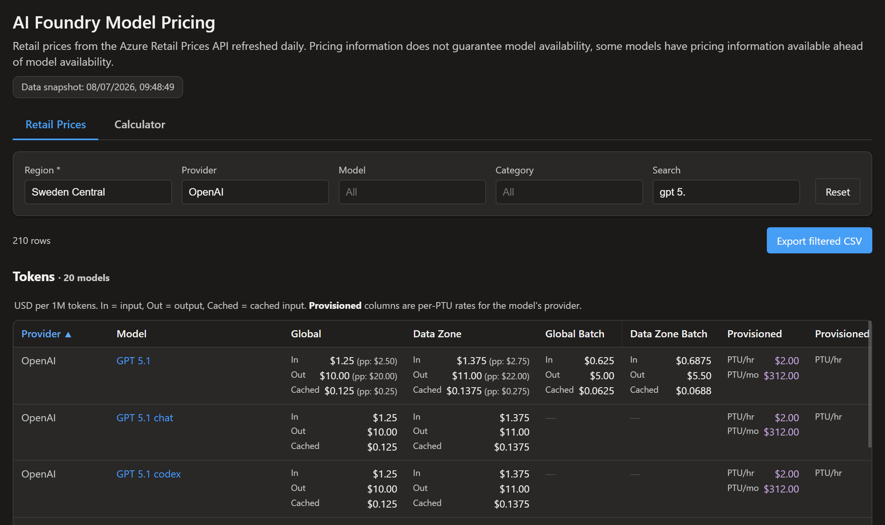
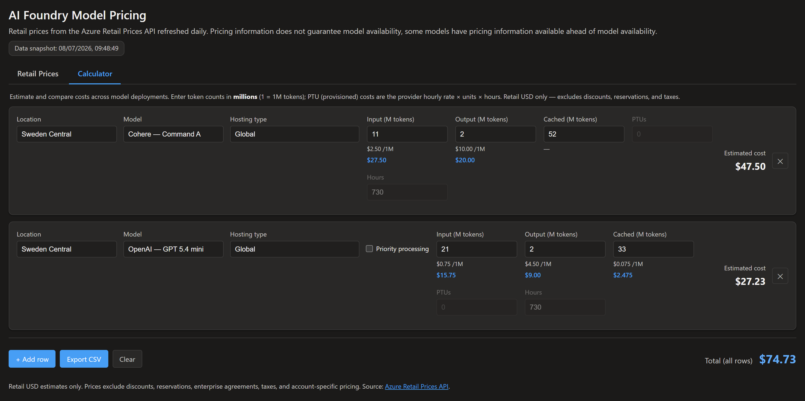

# AI Foundry Model Pricing ([ai-pricing.azxplorer.com](ai-pricing.azxplorer.com))

Look up and compare Azure AI Foundry model pricing, pulled directly from the
[Azure Retail Prices API](https://prices.azure.com/api/retail/prices).

## Retail Prices

Filter by region, provider, model, and category to browse normalized pricing
for every AI Foundry model and billing type.

## Calculator

Estimate and compare costs across model deployments by entering expected
token volumes.

## Deployment

The GitHub Actions deployment provisions an Azure Static Web App from
`infra/main.bicep` and then uploads the built `dist` package. Configure these
repository secrets for the OIDC login:

| Secret | Purpose |
| --- | --- |
| `AZURE_CLIENT_ID` | Client ID of the GitHub Actions OIDC application or managed identity. |
| `AZURE_TENANT_ID` | Azure tenant ID for the OIDC login. |
| `AZURE_SUBSCRIPTION_ID` | Azure subscription that hosts the app. |

Configure these repository variables for the deployment:

| Variable | Purpose |
| --- | --- |
| `AZURE_RESOURCE_GROUP` | Resource group created or reused by the workflow. |
| `AZURE_STATIC_WEB_APP_NAME` | Globally unique name for the Static Web App. |
| `AZURE_LOCATION` | Resource group and app region. |
| `CUSTOM_DOMAIN` | Optional custom domain to associate with the Static Web App. |

Grant the OIDC identity permission to create the resource group and deploy the
`Microsoft.Web/staticSites` resource. The workflow obtains the Static Web App
deployment token from Azure at deployment time; no deployment token is stored
as a repository secret or variable. When configuring `CUSTOM_DOMAIN`, create
the required CNAME record before deployment so Azure can validate the domain.
